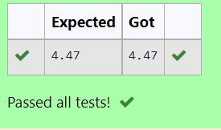

# DISTANCE-BETWEEN-TWO-POINTS

## AIM:
To write a python program to find the distance two 2 points
## ALGORITHM:
### Step 1: 
### Step 2: 
### Step 3: 
Substitute the values in the distance formula  
### Step 4: 
### Step 5: 
### PROGRAM:
```
  #Program to find the distance between two points.
#Developed by: vidya neela
#RegisterNumber:21500298
import math
l1=[10,6]
l2=[4,2]
value=math.sqrt(((l1[0]-l2[0])**2)-((l1[1]-l2[1])**2))
print("{:.2f}".format(value))
```
### OUTPUT:


### RESULT:
